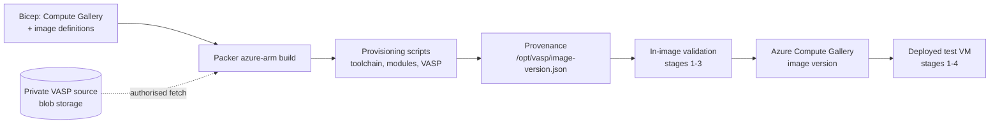

# Azure VASP HPC Image Factory

Builds, validates, versions and publishes immutable Azure VM images for running VASP on
Microsoft Azure, using HashiCorp Packer and Azure Compute Gallery.

Four image variants are produced:

| Image definition | Target SKU | Region | Arch flag |
| --- | --- | --- | --- |
| `vasp-hbv3` | `Standard_HB120rs_v3` | *unset — see below* | `-march=znver3` |
| `vasp-hbv4` | `Standard_HB176rs_v4` | `southcentralus` | `-march=znver4` |
| `vasp-nca100` | `Standard_NC24ads_A100_v4` | `centralus` | `-gpu=cc80` |
| `vasp-ndh100` | `Standard_ND96isr_H100_v5` | *unset — see below* | `-gpu=cc90` |

Each variant targets **exactly one VM SKU in exactly one region**, because HPC and GPU
quota is granted per SKU family per region. Both are pinned in
`packer/<variant>.pkrvars.hcl`, which is the single source of truth: the build VM, the
gallery replication target and the post-deployment test VM all follow it.

The A100 image builds in Central US and the HBv4 image in South Central US. `vasp-hbv3`
and `vasp-ndh100` have no region pinned yet — set `location` in their pkrvars files, or
export `PKR_VAR_location` as a fallback.

## Toolchains

| | CPU (`vasp-hbv3`, `vasp-hbv4`) | GPU (`vasp-nca100`, `vasp-ndh100`) |
| --- | --- | --- |
| Base image | `microsoft-dsvm:ubuntu-hpc:2204` | `microsoft-dsvm:ubuntu-2204:2204-gen2:25.06.18` |
| Compiler | GCC 11 (12 selectable) | NVIDIA HPC SDK — `nvfortran`, `nvc`, `nvc++` |
| GPU offload | — | OpenACC, CUDA bundled with the HPC SDK |
| MPI | HPC-X OpenMPI (from the base image) | OpenMPI bundled with the HPC SDK |
| RDMA | UCX + Azure InfiniBand | InfiniBand (ND H100 v5) |
| BLAS / LAPACK | AMD AOCL — BLIS, libFLAME | NVHPC `-lblas`, `-llapack` |
| ScaLAPACK | AOCL ScaLAPACK | NVHPC `-Mscalapack` |
| FFT | AOCL-FFTW | cuFFT + FFTW |
| OpenMP | GCC libgomp | NVHPC `-mp` |
| HDF5 | enabled | disabled (gfortran-only `.mod` files) |
| VASP arch template | `makefile.include.gnu_ompi_aocl_omp` | `makefile.include.nvhpc_omp_acc` |

Build configuration is **not hand-written**: each build starts from the `makefile.include`
template that VASP ships in `arch/` and appends a generated override block
([scripts/cpu/makefile-overrides.sh](scripts/cpu/makefile-overrides.sh),
[scripts/gpu/makefile-overrides.sh](scripts/gpu/makefile-overrides.sh)) that fills in the
template's placeholder paths and the target architecture. No compiler flags are invented.

> **Version pins marked CONFIRM** — NVHPC `25.1` and AOCL `5.0.0` are defaults chosen for
> this scaffold and should be confirmed against your support matrix before production use.
> Both are Packer variables.

---

## Architecture



- **Packer (HCL2)** builds the image on the real target SKU, so InfiniBand and GPU
  hardware are validated during the build itself.
- **Azure Compute Gallery** distributes versioned, immutable image versions.
- **Bicep** describes all persistent Azure infrastructure. No portal configuration.
- **Bash** performs OS configuration; every script uses `set -euo pipefail`.
- **Environment Modules** expose VASP at runtime via `module load vasp`.
- **GitHub Actions** runs offline validation on every pull request. Image builds are never
  triggered implicitly.

---

## Repository structure

```
Makefile                     Entry point: init / validate / build / test
infra/
  gallery.bicep              Compute Gallery, image definitions, build-identity RBAC
  gallery.bicepparam         Non-secret parameters (env-driven)
packer/
  packer.pkr.hcl             Required Packer + plugin versions
  variables.pkr.hcl          All input variables (no subscription data)
  sources.pkr.hcl            azure-arm source and gallery destination
  build.pkr.hcl              Provisioner pipeline and build manifest
  hbv3.pkrvars.hcl           HBv3 CPU image parameters (znver3)
  hbv4.pkrvars.hcl           HBv4 CPU image parameters (znver4)
  nca100.pkrvars.hcl         A100 GPU image parameters (cc80)
  ndh100.pkrvars.hcl         H100 GPU image parameters (cc90)
scripts/
  lib/common.sh              Logging, structured failures, provenance recording
  common/00-base-packages.sh Minimal package set; installs validation into the image
  common/20-environment-modules.sh  'vasp' modulefile, including toolchain paths
  common/30-vasp-install.sh  Authorised private fetch of the VASP source
  common/31-vasp-build.sh    Arch template + overrides, compile, install
  common/40-provenance.sh    Writes /opt/vasp/image-version.json
  common/90-cleanup.sh       Removes source, credentials and build artifacts
  cpu/10-hpc-toolchain.sh    GCC, HPC-X/UCX/IB verification, AOCL, HDF5
  cpu/makefile-overrides.sh  AOCL paths, -march, HDF5 for the GCC arch template
  gpu/10-nvidia-stack.sh     NVIDIA HPC SDK install, driver/CUDA/compute-capability checks
  gpu/makefile-overrides.sh  -gpu=ccXX,cudaXX.Y and FFTW paths for the NVHPC arch template
  validate/                  Four-stage validation, also installed to /opt/vasp/validate
  test/image-smoke-test.sh   Deploy from gallery, validate, destroy
.github/workflows/validate.yml  lint / packer-validate / infrastructure-validate
```

---

## Prerequisites

| Tool | Purpose |
| --- | --- |
| [Packer](https://developer.hashicorp.com/packer) ≥ 1.9 | Image builds |
| [Azure CLI](https://learn.microsoft.com/cli/azure/) | Authentication, Bicep, test VMs |
| `make`, `bash` | Orchestration |
| `shellcheck` (optional) | Shell linting |

Azure prerequisites:

- Quota for each target SKU **in that variant's region** (see the table above). Quota is
  granted per SKU family per region, which is why region is a per-variant setting.
- A resource group for the Compute Gallery. The gallery may live in a different region
  from the builds; image versions are replicated to each variant's region.
- An identity with rights to create the build VM and publish gallery image versions.

By default Packer creates a temporary resource group in the variant's region and deletes
it when the build finishes. Set `build_resource_group` only if you need builds to run in a
pre-existing resource group — note that doing so makes **that** resource group's region
the build region, overriding `location`.

---

## VASP licensing

VASP is commercial software. This repository contains **no** VASP source, binaries or test
data, and it never downloads VASP from a public location.

- The build fetches the source archive at run time from an authorised private location you
  provide (`vasp_source_uri`), preferably private Azure Blob Storage read with the build
  VM's managed identity.
- The source is staged with restrictive permissions, is never listed in build output, and
  is deleted by `scripts/common/90-cleanup.sh` before image capture.
- Published images must go to a private gallery. Never publish VASP binaries publicly.
- Stage 4 smoke tests use a test case that *you* supply; no licensed test material is
  distributed here.

`source/` and VASP archives are git-ignored, and the `licensing-guard` CI job fails the
build if licensed material is ever committed.

---

## Configuration

No subscription data is stored in this repository. Export the following before building:

```bash
export PKR_VAR_subscription_id="<subscription id>"
export PKR_VAR_tenant_id="<tenant id>"
export PKR_VAR_resource_group="<gallery resource group>"
export PKR_VAR_gallery_name="<compute gallery name>"

# Fallback region for variants that do not pin one (vasp-hbv3, vasp-ndh100)
export PKR_VAR_location="southcentralus"

# Authorised private VASP source (optional; omitted builds a toolchain-only image)
export PKR_VAR_vasp_source_uri="https://<account>.blob.core.windows.net/<container>/vasp.6.4.3.tgz"
```

Region and SKU are **not** environment variables: they belong to the variant, in
`packer/<variant>.pkrvars.hcl`. A value pinned there overrides `PKR_VAR_location`.

Authentication uses the signed-in Azure CLI identity by default (`az login`). For CI, set
`PKR_VAR_use_azure_cli_auth=false` and use managed identity or workload identity
federation. Secrets belong in Azure Key Vault or GitHub Actions secrets — never in files.

---

## Deploying the infrastructure

```bash
az group create --name <gallery resource group> --location <region>
az deployment group create \
  --resource-group <gallery resource group> \
  --parameters infra/gallery.bicepparam
```

This creates the gallery and both image definitions (`vasp-hbv3`, `vasp-nca100`) as
generalised Linux Gen2 definitions.

---

## Building images

```bash
make init                                  # install Packer plugins, check tooling
make validate                              # offline validation, no Azure resources
make build-hbv3 IMAGE_VERSION=1.0.0        # HBv3 CPU image  -> gallery
make build-hbv4 IMAGE_VERSION=1.0.0        # HBv4 CPU image  -> gallery
make build-a100 IMAGE_VERSION=1.0.0        # A100 GPU image  -> gallery
make build-h100 IMAGE_VERSION=1.0.0        # H100 GPU image  -> gallery
```

Every build:

1. Provision a temporary VM of the variant's SKU in the variant's region.
2. Install and verify the toolchain (GCC/HPC-X/UCX/AOCL/HDF5, or NVIDIA HPC SDK).
3. Install the `vasp` environment module, wired to that exact toolchain.
4. Fetch and build VASP (skipped when `vasp_source_uri` is empty).
5. Write `/opt/vasp/image-version.json`.
6. Run validation stages 1–3 inside the image.
7. Remove licensed source, credentials and build artifacts.
8. Deprovision and publish a new gallery image version.

Image versions are semantic (`1.0.0`, `1.0.1`, `1.1.0`) and are never overwritten —
publishing an existing version fails.

**Troubleshooting a failed build:** `make build-hbv3 IMAGE_VERSION=1.0.1
KEEP_FAILED_BUILD_VM=1` passes `-on-error=abort` to Packer, retaining the temporary build
VM and its resources for inspection. Delete them manually afterwards; never use this in CI.

---

## Build provenance

Every image contains `/opt/vasp/image-version.json`, recording the OS, kernel, VASP
version, compilers, MPI, math libraries, CUDA and driver versions, hardware inventory,
git SHA, build timestamp and image version. Provisioning scripts record facts with
`record_component`; `common/40-provenance.sh` renders the manifest. Any recorded fact that
is not explicitly mapped appears under `additional` rather than being dropped.

---

## Validation

Validation runs in four stages (`scripts/validate/run-validation.sh`), installed in the
image at `/opt/vasp/validate` so a deployed VM can be re-validated at any time.

| Stage | Checks |
| --- | --- |
| 1 — OS | kernel, os-release, filesystem headroom, required commands, valid provenance manifest |
| 2 — hardware | CPU: `lscpu`, `numactl --hardware`, `ibv_devinfo`, UCX, HPC-X `mpirun`. GPU: `lscpu`, `nvidia-smi`, GPU count/model, compute capability vs the built `ccXX`, NVHPC compilers |
| 3 — VASP | binaries present, `ldd` resolves every dependency, `module load vasp`, binary launches |
| 4 — smoke test | runs a user-supplied VASP test case and checks for normal termination |

Stages 1–3 run during the Packer build. Stage 4 runs post-deployment and is skipped unless
`VASP_SMOKE_TEST_DIR` points at a directory containing `INCAR`, `POSCAR`, `POTCAR` and
`KPOINTS`.

Runtime is recorded but is not a pass/fail gate: correctness testing ("does the image
work?") and performance benchmarking ("does the image perform as expected?") are separate
concerns, and no performance baseline is defined yet.

---

## Deploying a test VM

```bash
make test-hbv3 IMAGE_VERSION=1.0.0
make test-hbv4 IMAGE_VERSION=1.0.0
make test-a100 IMAGE_VERSION=1.0.0
make test-h100 IMAGE_VERSION=1.0.0
```

Each target creates a dedicated resource group, deploys one VM from the gallery image,
runs validation through `az vm run-command`, and deletes the resource group on exit —
including on failure. The SKU and region are read from the variant's pkrvars file, so the
test VM always lands where the image was built and replicated. The SKU, region and maximum
lifetime are printed and require typed approval unless `AUTO_APPROVE=1` is set. Use
`KEEP_TEST_VM=1` to retain resources for troubleshooting (remember to delete them).

To run VASP manually on a deployed VM:

```bash
module load vasp
mpirun -np <ranks> vasp_std
```

Rank counts, thread counts and CPU/NUMA affinity are job-level settings and are
deliberately not baked into the image. Discover the topology on the VM with `lscpu` and
`numactl --hardware` rather than assuming a fixed CPU numbering.

---

## CI/CD

`.github/workflows/validate.yml` runs on pull requests and pushes to `main`:

| Job | Purpose |
| --- | --- |
| `licensing-guard` | Fails if VASP source or test data is committed |
| `lint` | `bash -n` and `shellcheck` for every script |
| `packer-validate` | `packer fmt -check` and `packer validate` for both variants |
| `infrastructure-validate` | Compiles the Bicep templates |

No Azure resources are created by CI. Image build and publish workflows are intentionally
not wired up yet; when added they must be `workflow_dispatch`/release-tag only, with
concurrency controls to prevent duplicate builds.

---

## Cost controls

- HBv3 and A100 VMs are never created implicitly — pull requests run offline checks only.
- `make test-*` prints the SKU, region and maximum lifetime, and requires typed approval.
- Test resources live in a dedicated resource group deleted by an `EXIT` trap.
- `az vm create` and `az vm run-command` are wrapped in `timeout` (`TEST_TIMEOUT`).
- Failed builds clean up unless troubleshooting retention is explicitly requested.

---

## Security

- No credentials, keys or subscription data in the repository; configuration is
  environment-driven and secrets come from Key Vault or GitHub Actions secrets.
- Prefer workload identity federation from GitHub Actions and managed identity on Azure
  VMs. The VASP source download uses an IMDS token by default and never logs credentials;
  `curl` reads its configuration from stdin so tokens never appear in the process list.
- The SAS token variable is marked `sensitive` so Packer redacts it from build output.
- Cleanup removes SSH authorized keys, `.azure` profiles, shell history, package caches
  and the licensed source tree before capture.
- Only a minimal package set is installed.

---

## Unresolved decisions

These are deliberately open and must be settled before the images are production-ready.

1. **Version pins needing confirmation.** NVHPC `25.1` and AOCL `5.0.0` are scaffold
   defaults. Confirm them against your VASP support matrix, then treat them as pinned.
2. **AOCL delivery.** AOCL is EULA-gated, so this repository cannot download it. The CPU
   script uses an AOCL already present in the base image; otherwise you must host the AMD
   `.deb`/tarball privately and set `aocl_download_uri`.
3. **CPU base image pinning.** `microsoft-dsvm:ubuntu-hpc:2204` still uses
   `os_version = "latest"`, which is not reproducible. The GPU image is pinned to
   `25.06.18`.
4. **GCC 12 + HDF5.** `gcc_version = "12"` requires HDF5 to be rebuilt, because the
   distribution `libhdf5-dev` Fortran `.mod` files are produced by gfortran 11.
5. **GPU-side MPI over InfiniBand.** The GPU images use the OpenMPI bundled with the HPC
   SDK. Multi-node performance on ND H100 v5 needs verification against the Azure
   InfiniBand stack, which the DSVM base image does not ship.
6. **HDF5 for GPU images.** Disabled, since nvfortran cannot consume gfortran `.mod`
   files. Enabling it requires building HDF5 with nvfortran.
7. **VASP source integrity.** `VASP_SOURCE_SHA256` is optional; make it mandatory once the
   authoritative archive checksum is known.
8. **Parallel build flag.** `vasp_make_args = "DEPS=1"` enables VASP's dependency-based
   parallel build. Confirm for your VASP version, or set it empty for a serial build.
9. **Build networking.** Build VMs currently get a public IP unless
   `build_virtual_network_*` is set. A private build subnet (with Bicep) is preferable.
10. **Stage 4 in CI.** Uploading a licensed test case to the test VM is not implemented;
    the test-data source and transfer mechanism are undecided.
11. **Gallery security type and replication.** Trusted Launch / Confidential VM support and
    the replication region list are not yet decided; replication defaults to the build
    region only.
12. **Performance baselines.** No baseline exists, so performance results cannot gate
    publication yet.
